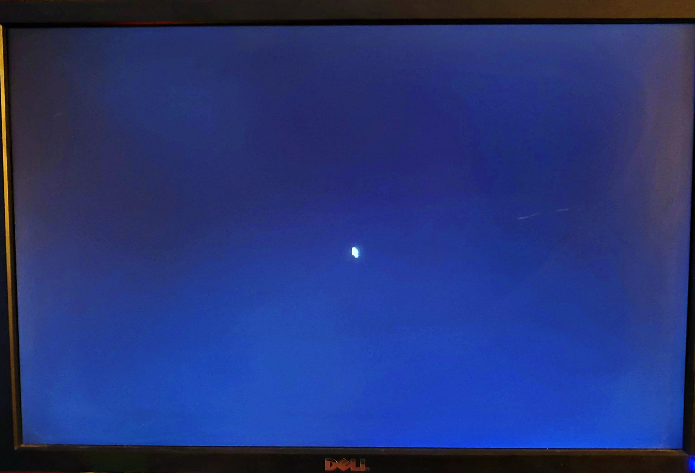

# Project 42: Mouse In The House

* __Official repo for the "42" Digital System Design Final Project__ *

Contributers:
* [Andrew D'Angelo](https://sites.google.com/d/1RBr_eKZI24EjTWzsZB4v3GX3XFpaC1NY/p/18CrMngnyxBPsVCTbK__N-a7D6eivdq0i/edit)
* [Tahrim Imon](https://sites.google.com/stevens.edu/tahrim-imon-mobius-propage?pli=1&authuser=2)


## Overview

Since the project began, the team set out with a singular mission to develop an understanding of HID USB mouse integration using the Nexsys A7-100T FPGA board. Over the previous few months, we struggled with identifying the best way we could demonstrate successful mouse functionality. Initially, the team explored integrating mouse display and control functionality with a previous DSD project; however, we quickly came to realize the complexity of the task was too great for the limited time we had to work on the project. All in all, with the assistance of a fellow classmate (shoutout to Gupreet), the team successfully managed to strip the mouse code down to its very foundation and was able to develop an indepth understanding of the MouseDisplay and MouseCtl files developed by Xilinx.  

## Breaking down the HID Mouse

To integrate the HID USB mouse using VHDL and properly use it on the Nexsys A7 100-T board, a few key files must be added and an adjustment be made to the board. 

### Adjusting the jumper
As may be observed below, to use the USB mouse you need to move the blue MODE jumper ( as was performed in lab #2 ) to the __USB/SD__ pin.


 
 
 ### Displaying the Mouse Cursor
 
 To display the mouse cursor in your VHDL project, you need to include the _MouseDisplay.vhdl_ module found in this repo. This file is dependent upon the _MouseCtl.vhdl_ module to provide the x and y position of the cursor and outputs vga red, green, and blue signals to display on the screen. A port map of the file can be observed below:
 
 ```
 port (
   pixel_clk: in std_logic;
   xpos     : in std_logic_vector(11 downto 0);
   ypos     : in std_logic_vector(11 downto 0);

   hcount   : in std_logic_vector(11 downto 0);
   vcount   : in std_logic_vector(11 downto 0);
   --blank    : in std_logic; -- if VGA blank is used

   --red_in   : in std_logic_vector(3 downto 0); -- if VGA signal pass-through is used
   --green_in : in std_logic_vector(3 downto 0);
   --blue_in  : in std_logic_vector(3 downto 0);
   
   enable_mouse_display_out : out std_logic;

   red_out  : out std_logic_vector(3 downto 0);
   green_out: out std_logic_vector(3 downto 0);
   blue_out : out std_logic_vector(3 downto 0)
);
 ```
 
 ___MouseDisplay.vhdl_ Port Definitions:__
 * _xpos_: ( input pin ) : the x position of the mouse realitive to the top, left-hand corner of the screen.
 * _ypos_: ( input pin ) : the y position of the mouse realitive to the top, left-hand corner of the screen.
 * *pixel_clk*: ( input pin ) : clock used to read pixels from internal memory and then outputs data on the vga color outputs. Different screen resolutions can be achieved by changing the speed of the clock: 25MHz --> 640x480, 40MHz --> 800x600, 108MHz --> 1280x1024.
 * _hcount_: ( input pin ) : recounts the horizontal position of the current pixel from left to right on the screen.
 * _vcount_: ( input pin ) : recounts the vertical position of the current pixel from left to right on the screen.
 * *red_out*: ( output pin ) : 4 bit color output to the red vga pins.
 * *green_out*: ( output pin ) : 4 bit color output to the green vga pins.
 * *blue_out*: ( output pin ) : 4 bit color output to the blue vga pins.
 
 The _MouseDisplay.vhdl_ file __ONLY__ displays the mouse cursor on a vga screen. If you want to implement mouse functionality you will need to use a separate additional files.
 
 ### Changing Cursor color, shape, and size
 
 The _MouseDisplay.vhdl_ file is set by default to display a 16 x 16 pixel black and white cursor. For a matter of demonstration purposes, the steps below will describe how to change the size of the cursor from 16 x 16 pixels to 32 x 32 pixels:
1. Locate `type displayrom` ( around line 135 ) and change `array(0 to 255)` to `array(0 to 1023)`.
2. Scroll down to `constant mouserom`, comment out the 16 bit default, and uncomment the 32 bit pixel array.

You may take notice that the `constant mouserom` is an array of 2 bit combinations of 0 and 1. In the case of this file, each combination correlates to a color, take a look at the snippet below:

```
 if(enable_mouse_display = '1') then
               -- white pixel of cursor
               if(mousepixel = "01") then
                  red_out <= "1111"; --(others => '1');
                  green_out <= "1111"; --(others => '1');
                  blue_out <= "1111"; --(others => '1');
               -- black pixel of cursor
               elsif(mousepixel = "00") then
                  red_out <= (others => '0');
                  green_out <= (others => '0');
                  blue_out <= (others => '0');
               -- transparent pixel of cursor
               -- let input pass to output
--               else
--                  red_out <= red_in;
--                  green_out <= green_in;
--                  blue_out <= blue_in;
               end if;
```
_Note: you can find this snippet at ~line 284 in MouseDisplay.vhdl_


within the conditionals you may observed a 4 bit assignment for each port: red_out, green_out, blue_out. By default, __"1111"__, sets the signals to white so that the 2 bit combination of __"01"__, will be interpreted as white. Likewise, __"0"__, sets the signal to black so that the 2 bit combination of __"00"__, will be interpreted as black. To change these color assignments, simply change the 4 bit signal being assigned to each of the three vga ports.

As for shape, the pattern by which each 2 bit element is arranged in the array will determine the shape of the cursor displayed. This is shown in the snippet below.

__Note: the "11" in the array is interpreted as transparent__

```
constant mouserom: displayrom := (
"00","00","11","11","11","11","11","11","11","11","11","11","11","11","11","11",
"00","01","00","11","11","11","11","11","11","11","11","11","11","11","11","11",
"00","01","01","00","11","11","11","11","11","11","11","11","11","11","11","11",
"00","01","01","01","00","11","11","11","11","11","11","11","11","11","11","11",
"00","01","01","01","01","00","11","11","11","11","11","11","11","11","11","11",
"00","01","01","01","01","01","00","11","11","11","11","11","11","11","11","11",
"00","01","01","01","01","01","01","00","11","11","11","11","11","11","11","11",
"00","01","01","01","01","01","01","01","00","11","11","11","11","11","11","11",
"00","01","01","01","01","01","00","00","00","00","11","11","11","11","11","11",
"00","01","01","01","01","01","00","11","11","11","11","11","11","11","11","11",
"00","01","00","00","01","01","00","11","11","11","11","11","11","11","11","11",
"00","00","11","11","00","01","01","00","11","11","11","11","11","11","11","11",
"00","11","11","11","00","01","01","00","11","11","11","11","11","11","11","11",
"11","11","11","11","11","00","01","01","00","11","11","11","11","11","11","11",
"11","11","11","11","11","00","01","01","00","11","11","11","11","11","11","11",
"11","11","11","11","11","11","00","00","11","11","11","11","11","11","11","11"
);
```

 
 ### Adding Cursor Functionalities-- click, scroll, etc.
 
 Cursor functionality, such as clicking and scrolling, is controlled in the _MouseCtl.vhdl_ module. The _MouseCtl.vhdl_ module is a dependent of the _PS2Interface.vhdl_ module so to add cursor functionalities to your project you __MUST__ include both modules.
 
 __PS2Interface.vhdl__: 
 The module responsible for the delegation of data sent and recieved from the mouse to the other files in the program. Mainly, what's important to understand about this module is that its acts as a middle man between the _MouseCtl_ module and the mouse itself. _PS2Interface_ will receive data from the mouse, validate it, and send it to the _MouseCtl_ module over the `rx_data` channel. Then, it will receive data from the _MouseCtl_ module via the `tx_data` channel and will validate the data per the _write_ output signal.
 
 __MouseCtl.vhdl__
 The _MouseCtl.vhdl_ module is responsible for calculating the x, y, and z position of the cursor; processing left, right, and middle button clicks; and setting / resetting the global clock signal.
 
 A port map for the _MouseCtl.vhdl_ module can be viewed below:
 
 ```
 port(
   clk         : in std_logic;
   rst         : in std_logic;
   xpos        : out std_logic_vector(11 downto 0);
   ypos        : out std_logic_vector(11 downto 0);
   zpos        : out std_logic_vector(3 downto 0);
   left        : out std_logic;
   middle      : out std_logic;
   right       : out std_logic;
   new_event   : out std_logic;
   value       : in std_logic_vector(11 downto 0);
   setx        : in std_logic;
   sety        : in std_logic;
   setmax_x    : in std_logic;
   setmax_y    : in std_logic;
   
   ps2_clk     : inout std_logic;
   ps2_data    : inout std_logic
   
);
 ```
 
 ___MouseCtl.vhdl_ Port Definitions:__
 * _clk_: ( input pin ) : the global clock signal of the mouse files. By default it is set to __100MHz__.
 * _rst_: ( input pin ) : the global reset signal. When fired it will reset the global clock.
 * _xpos_: ( output pin ) : the x position of the cursor in relativity to the top left-hand corner of the screen.
 * _ypos_: ( output pin ) : the y position of the cursor in relativity to the top left-hand corner of the screen.
 * _zpos_: ( output pin ) : the last change in movement on the z axis. The z axis represents scrolling on the screen. If scrolling is disabled then the _zpos_ isn't relevant.
 * _left_: ( output pin ) : tracks the left click on the mouse. If the left mouse button is clicked, _left_ is set to high.
 * _right_: ( output pin ) : tracks the right click on the mouse. If the right mouse button is clicked, _right_ is set to high.
 * _middle_: ( output pin ) : tracks the middle click on the mouse. If the middle mouse button is clicked, _middle_ is set to high.
 * _new_event_: ( output pin ) : becomes active after receiving and processing a new movement data packet for one clock cycle.
 
 
 ## Results
 
 The team was successfully able to isolate the mouse integration modules and display a simple mouse cursor on a vga monitor as may be seen below.
 
 
